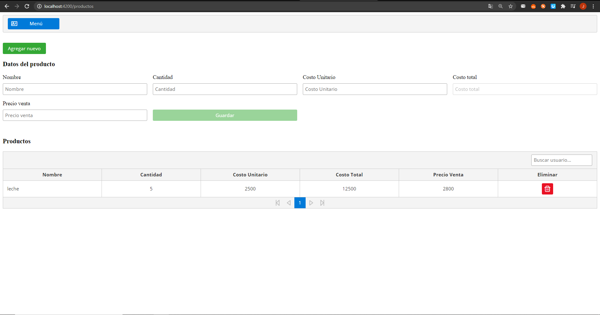
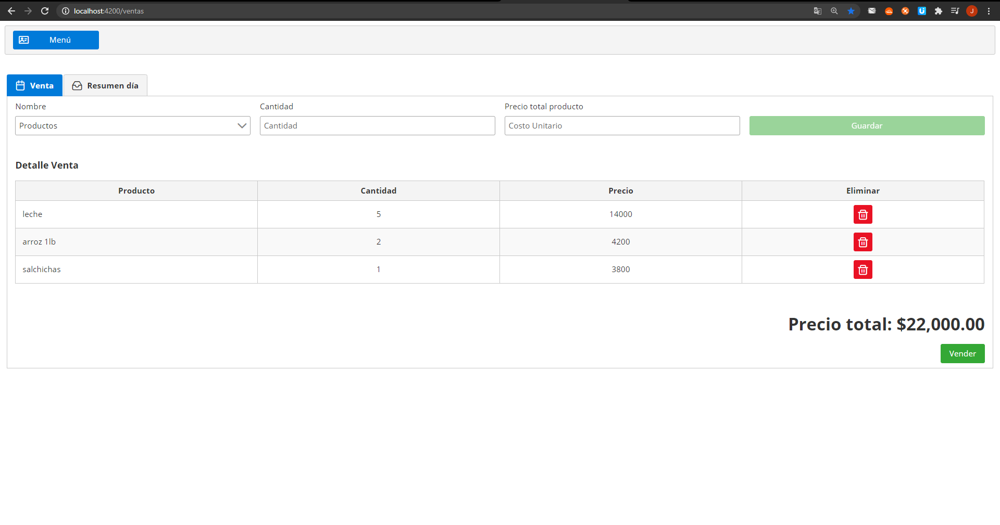
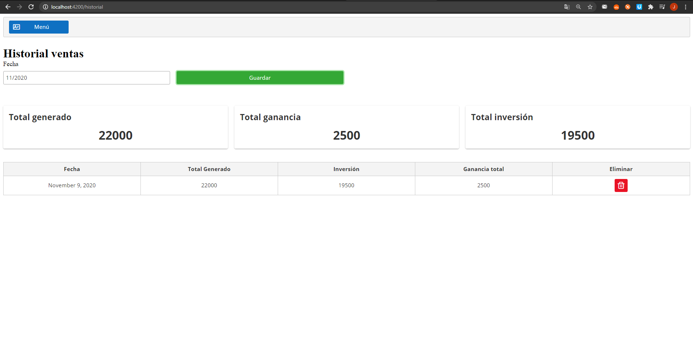

# Mi tienda

Aplicacion basica para el manejo y administración de una tienda pequeña.

## Funcionalidades 

* gestion de productos de cualquier tipo.
* vista para generar una venta con el total de la venta con el detalle de productos a vender.
* historial mensual de la ventas con información detallada de cuanto fue el neto generado y cuando fue 
el totat de lo vendido.

## Construido con 🛠️

Este proyecto esta construido con las siguientes tecnologias:

## Backend 

* Java 1.8
* Spring MVC with Spring Boot
* H2
* Maven
* Flyway

## Frontend

* Angular 9
* PrimeNg

 * La arquitectura web está construida con los siguientes componentes:
   * DTO: Objetos que se usan para la comunicación a través de las API
   * Controller: Responde a eventos lanzados por el usuario desde la web.
   * Service: Implementa la logica de procesamiento de información y la logica de negocio.
   * Repository: Interfaces para la base de datos, guarda, elimina y consulta.
   * Entity: Entidades de la base de datos.
   

## Capturas de pantalla

* Vista de gestión de productos.	

* Vista de generación de venta.

* Vista de historial mensual de venta.

## Autores ✒️

* **Jhon Freddy salamanca** - [jhonfre1994](https://github.com/jhonfre1994)

